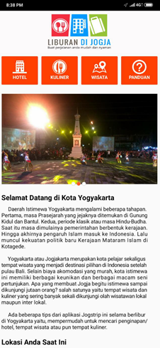
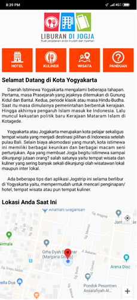
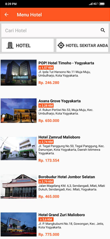
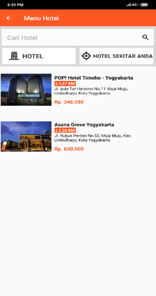
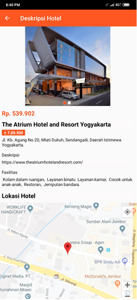
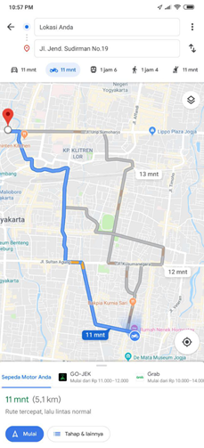
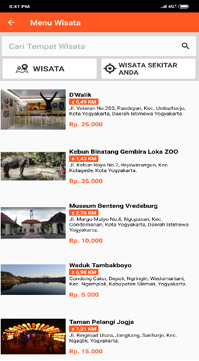
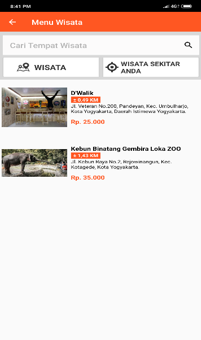
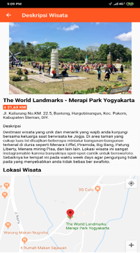
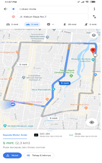

<!-- 

 -->

## Aplikasi Pencarian Hotel, Tempat Kuliner dan Tempat Wisata 

Bencana adalah peristiwa atau rangkaian peristiwa yang mengancam dan mengganggu kehidupan dan penghidupan masyarakat yang disebabkan baik oleh faktor alam dan/ atau faktor non alam maupun faktor manusia sehingga mengakibatkan timbulnya korban jiwa manusia kerusakan lingkungan kerugian harta benda dan dampak psikologis (UU No 24 Tahun 2007):

## Penggunaan Sistem : 
1.	Halaman Utama

<table border="0" align="center">
 <tr>
    <td>
        

    </td>
    <td>
        

    </td>
 </tr>
</table>

Saat pertama kali user membuka aplikasi yang akan tampil yaitu logo aplikasi, setelah itu sistem akan menampilkan halaman utama atau beranda yang dimana isinya terdapat logo aplikasi yang terletak dibagian atas. Kemudian di bawah logo terdapat 4 menu bar diantaranya, menu hotel, menu kuliner, menu wisata dan menu panduan. Pada bagian bawah menu bar terdapat deskripsi singkat mengenai kota yogyakarta dan sejarah singkatnya Yogyakarta, di bagian bawah deskripsi terdapat fragment map yang berfungsi untuk mengetahui lokasi kita saat ini. Sangant berguna banget bagi orang yang belum mengetahui posisi lokasi saat ini.

2.	Halaman Menu Hotel

Pada halaman beranda jika user menekan tombol menu hotel maka sistem akan menampilkan halaman hotel yang didalamnya terdapat 2 tombol yaitu tombol list hotel dan tombol hotel sekitar serta bar pencarian hotel. Masing-masing menu memiliki aktivitas yang berbeda, pada menu pencarian user bisa dapat menginputkan kata kunci untuk melakukan pencarian hotel. Kemudian sistem akan menampilkan halaman hotel hasil pencarian yang telah diinputkan oleh user. Saat user menekan tombol menu list hotel sistem akan menampilkan semua data hotel yang terdapat pada database, sedangkan jika user menekan tombol menu hotel sekitar sistem akan menampilkan data hotel di sekitaran lokasi user yang berjarak kurang lebih 3 kilo meter dari posisi user berada.

<table border="0">
 <tr>
    <td align="center">
        

    </td>
    <td align="center">
        

    </td>
 </tr>
 <tr>
    <td>
        a. Tombol Hotel
        
Pada halaman ini sistem akan menampilkan semua data hotel yang terdapat pada database yang terdapat di Provinsi Daerah Istimewa Yogyakarta.

    </td>
    <td>
        b. Tombol Hotel Sekitar
        
Pada halaman ini sistem akan menampilkan halaman hotel sekitar dari posisi user berada jika menekan tombol hotel sekitar anda pada halaman menu hotel. Maka sistem akan langsung menampilkan halaman hotel di sekitar user berada.

    </td>
 </tr>
</table>

3.	Halaman Deskripsi Hotel dan Petunjuk Arah

<table border="0" align="center">
 <tr>
    <td>
        

    </td>
    <td>
        

    </td>
 </tr>
 <tr>
    <td>
        
Setelah user menemukan hotel yang diinginkan, user dapat menekan tombol pilihan hotel maka sistem akan menampilkan halaman deskripsi hotel yang dimana didalamnya terdapat gambar hotel dari hotel yang telah di pilih serta deskripsi mengenai hotel yang telah di pilih. Pada bagian bawah deskripsi terdapat fragment map lokasi hotel berada, yang dimana fragment map dapat di perbesar atau pun di perkecil. Pada bagian bawah nya fragment terdapat beberapa tempat pilihan seperti hotel, tempat wisata dan tempat kuliner terdekat dari lokasi hotel yang terpilih. Pada bagian tempat pilihan juga terdapat jarak tempuh dari posisi hotel yang terpilih. Jika ingin menuju lokasi hotel yang terpilih, user dapat menekan fragment map kemudian tekan tombol panah yang nantinya akan dialihkan ke aplikasi google map dan user dapat mengetahui rute jarak tempuhnya.

    </td>
    <td>
        
Halaman ini merupakan halaman yang menampilkan rute petunjuk arah untuk menempuh perjalanan menuju lokasi hotel yang telah terpilih. Pada tampilan ini user juga dapat memilih rute yang tersedia pada halaman ini sehingga tidak perlu pusing untuk menentukan jalur mana yang lebih cepat sampai menuju lokasi hotel. Halaman ini juga menampilkan estimasi waktu berapa lama menuju tempat tujuan. Sehingga user tidak perlu pusing memikirkan waktu tempuhnya berapa lama menuju lokasi yang akan di tuju.

    </td>
 </tr>
</table>

4.	Halaman Menu Wisata

Pada halaman beranda jika user menekan tombol menu wisata maka sistem akan menampilkan halaman tempat wisata yang didalamnya terdapat 2 tombol yaitu tombol list wisata dan tombol wisata sekitar serta bar pencarian wisata. Masing-masing menu memiliki aktivitas yang berbeda, pada menu pencarian user bisa dapat menginputkan kata kunci untuk melakukan pencarian wisata. Kemudian sistem akan menampilkan halaman wisata hasil pencarian yang telah diinputkan oleh user. Saat user menekan tombol menu list wisata sistem akan menampilkan semua data wisata yang terdapat pada database, sedangkan jika user menekan tombol menu wisata sekitar sistem akan menampilkan data tenpat wisata di sekitaran lokasi user yang berjarak kurang lebih 3 kilo meter dari posisi user berada.

<table border="0">
 <tr>
    <td align="center">
        

    </td>
    <td align="center">
        

    </td>
 </tr>
 <tr>
    <td>
        a. Tombol Wisata
        
Pada halaman ini sistem akan menampilkan semua data wisata yang terdapat pada database yang terdapat di Provinsi Daerah Istimewa Yogyakarta.

    </td>
    <td>
        b. Tombol Wisata Sekitar
        
Pada halaman ini sistem akan menampilkan halaman wisata sekitar, kemudian didalamnya terdapat beberapa data wisata yang terdapat disekitar user berada. Jika user ingin melihat kuliner disekitar, pada halaman menu wisata user bisa langsung menekan tombol wisata sekitar. Sistem akan menampilkan halaman kuliner sekitar.

    </td>
 </tr>
</table>

5.	Halaman Deskripsi Wisata dan Petunjuk Arah

<table border="0" align="center">
 <tr>
    <td>
        

    </td>
    <td>
        

    </td>
 </tr>
 <tr>
    <td>
        
Saat user memilih wisata yang terpilih maka sistem akan menampilkan halaman deskripsi wisata yang didalamnya menjelaskan isi mengenai wisata diantaranya terdapat gambar wisata, nama wisata, alamat wisata dan deskripsi mengenai wisata. Pada bagian bawah deskripsi terdapat fragment map lokasi tempat wisata berada, fragmen ini juga dapat berfungsi untuk melihat disekitaran lokasi tempat wisata. Dibagian fragment juga user dapat memperbesar dan memperkecil posisi lokasi tempat wisata. Jika user ingin mengetahui rute perjalanan menuju lokasi kuliner, pada bagian fragment tekan tombol panah kemudian sistem akan mengalihakan ke aplikasi google map yang akan menampilakan rute tujuan user.

    </td>
    <td>
        
Halaman ini merupakan halaman yang menampilkan rute petunjuk arah untuk menempuh perjalanan menuju lokasi tempat wisata yang telah terpilih. Pada tampilan ini user juga dapat memilih rute yang tersedia pada halaman ini sehingga tidak perlu pusing untuk menentukan jalur mana yang lebih cepat sampai menuju lokasi tempat wisata. Halaman ini juga menampilkan estimasi waktu berapa lama menuju tempat tujuan. Sehingga user tidak perlu pusing memikirkan waktu tempuhnya berapa lama menuju lokasi yang akan di tuju.

    </td>
 </tr>
</table>

## License

The Laravel framework is open-sourced software licensed under the [MIT license](https://opensource.org/licenses/MIT).