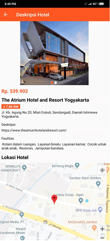

<!-- 

 -->

## Aplikasi Pencarian Hotel, Tempat Kuliner dan Tempat Wisata 

Bencana adalah peristiwa atau rangkaian peristiwa yang mengancam dan mengganggu kehidupan dan penghidupan masyarakat yang disebabkan baik oleh faktor alam dan/ atau faktor non alam maupun faktor manusia sehingga mengakibatkan timbulnya korban jiwa manusia kerusakan lingkungan kerugian harta benda dan dampak psikologis (UU No 24 Tahun 2007):

## Penggunaan Sistem : 
1.	Halaman Utama

<table border="0" align="center">
 <tr>
    <td>
        

    </td>
    <td>
        

    </td>
 </tr>
</table>

Saat pertama kali user membuka aplikasi yang akan tampil yaitu logo aplikasi, setelah itu sistem akan menampilkan halaman utama atau beranda yang dimana isinya terdapat logo aplikasi yang terletak dibagian atas. Kemudian di bawah logo terdapat 4 menu bar diantaranya, menu hotel, menu kuliner, menu wisata dan menu panduan. Pada bagian bawah menu bar terdapat deskripsi singkat mengenai kota yogyakarta dan sejarah singkatnya Yogyakarta, di bagian bawah deskripsi terdapat fragment map yang berfungsi untuk mengetahui lokasi kita saat ini. Sangant berguna banget bagi orang yang belum mengetahui posisi lokasi saat ini.

2.	Halaman Menu Hotel

<table border="0" align="center">
 <tr>
    <td>
        

    </td>
    <td>
        

    </td>
 </tr>
 <tr>
    <td>
        
Pada halaman beranda jika user menekan tombol menu hotel maka sistem akan menampilkan halaman hotel yang didalamnya terdapat 2 tombol yaitu tombol list hotel dan tombol hotel sekitar serta bar pencarian hotel. Masing-masing menu memiliki aktivitas yang berbeda, pada menu pencarian user bisa dapat menginputkan kata kunci untuk melakukan pencarian hotel. Kemudian sistem akan menampilkan halaman hotel hasil pencarian yang telah diinputkan oleh user.

    </td>
    <td>
        
Setelah user menemukan hotel yang diinginkan, user dapat menekan tombol pilihan hotel maka sistem akan menampilkan halaman deskripsi hotel yang dimana didalamnya terdapat gambar hotel dari hotel yang telah di pilih serta deskripsi mengenai hotel yang telah di pilih. Pada bagian bawah deskripsi terdapat fragment map lokasi hotel berada, yang dimana fragment map dapat di perbesar atau pun di perkecil.

    </td>
 </tr>
</table>

## License

The Laravel framework is open-sourced software licensed under the [MIT license](https://opensource.org/licenses/MIT).