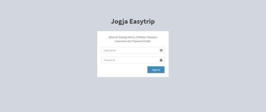
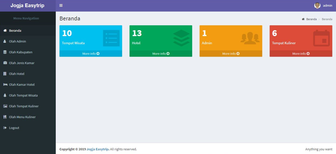
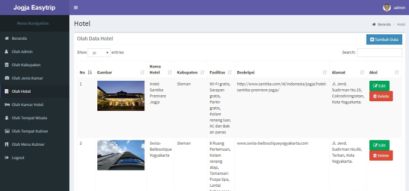
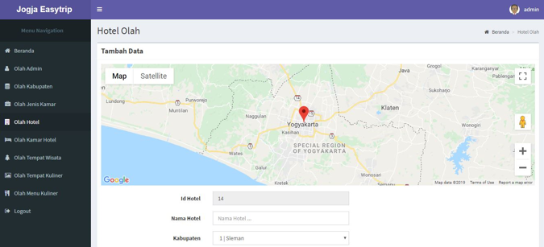
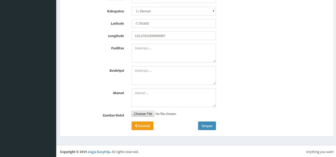

<!-- 

 -->

## Aplikasi Pencarian Hotel, Tempat Kuliner dan Tempat Wisata 

Mengembangkan media informasi pemetaan koordinat lokasi hotel, tempat wisata dan kuliner serta rute petunjuk arah yang dituju di Kota Yogyakarta berbasis Android.

## Analisis Sistem Saat ini

Kota Yogyakarta sebagai ibukota Propinsi Daerah Istimewa Yogyakarta (DIY) merupakan pusat dari berbagai aktivitas masyarakat antara lain pusat perdagangan, pendidikan, perindustrian, pemerintahan dan pariwisata. Selain gelar kota pelajar, kota Yogyakarta juga sebagai kota budaya karena banyaknya tempat-tempat peninggalan sejarah untuk pelestarian cagar budaya. Kota Yogyakarta mempunyai banyak tempat dan jenis objek wisata. Dari mulai wisata budaya, seperti keraton, bangunan candi, benteng, serta bangunan-bangunan kuno bersejarah, sampai wisata alam seperti objek wisata Kaliurang, pantai Parangtritis dan objek objek wisata yang lain.

Kota Yogyakarta sebagai ibukota Propinsi Daerah Istimewa Yogyakarta (DIY) merupakan pusat dari berbagai aktivitas masyarakat antara lain pusat perdagangan, pendidikan, perindustrian, pemerintahan dan pariwisata. Selain gelar kota pelajar, kota Yogyakarta juga sebagai kota budaya karena banyaknya tempattempat peninggalan sejarah untuk pelestarian cagar budaya. Kota Yogyakarta mempunyai banyak tempat dan jenis objek wisata. Dari mulai wisata budaya, seperti keraton, bangunan candi, benteng, serta bangunan-bangunan kuno bersejarah, sampai wisata alam seperti objek wisata Kaliurang, pantai Parangtritis dan objek objek wisata yang lain. 

Pemerintah Daerah Yogyakarta telah berusaha memberikan informasi sebagai penuntun wisatawan untuk menuju objek wisata tertentu, tetapi tidak bisa terjangkau secara detail. Karena sifatnya hanya sebagai penunjuk jalan, belum bisa mengarahkan ke suatu lokasi tertentu. Minimnya fasilitas penunjuk arah ini menjadikan para wisatawan kesulitan untuk mencari objek wisata.

Berdasarkan dengan banyaknya tempat wisata di Kota Yogyakarta maka tidak menutup kemungkinan bahwa yogyakarta menjadi pilihan destinasi wisata bagi wisatawan, dengan besarnya kemungkinan wisatawan yang datang ke yogyakarta maka akan besar pula pendapatan daerah, dan dengan banyaknya wisatawan yang datang ke kota yogyakarta maka tidak menutup kemungkinan akan banyak juga permintaan kamar hotel atau penginapan sebagai media untuk bermalam/menginap di kota yogyakarta, bagi kebanyakan masyarakat yang di luar kota yogyakarta maupun yang belum pernah datang ke kota yogyakarta akan sedikit sulit untuk menemukan hotel atau tempat penginapan di sekitar kota yogyakarta.

Pada gambaran diatas, dapat disimpulkan bahwa sistem saat ini memerlukan adanya sistem yang dapat memudahkan wisatawan local maupun inter local untuk memudahkan pencarian hotel atau penginapan sebagai media untuk bermalam/ menginap di kota yogyakarta. Sistem yang akan dibuat juga tidak hanya untuk pencarian hotel atau penginapan saja melainkan dapat melakukan pencarian tempat wisata dan tempat kuliner. Dengan adanya aplikasi pencarian hotel, tempat wisata dan tempat kuliner diharapkan dapat memudahkan wisatawan local maupun inter lokal yang datang atau berkunjung ke kota yogyakarta.

## Analisis Simtem yang Diusulkan

Sistem yang dibangun ini yaitu dengan membangun sebuah aplikasi pencarian hotel, tempat wisata dan kuliner di kota Yogyakarta berbasis android untuk mempermudah wisatawan local maupun inter local guna untuk mencari hotel atau penginapan, tempat wisata dan tempat kuliner. Sehingga pengguna dapat mengetahui deskripsi dan titik koordinat lokasi tersebut seperti, lokasi hotel, tempat wisata dan kuliner yang dicari atau disukai. Dalam penelitian ini, tahapan yang digunakan adalah sebagai berikut:

1. Pengambilan data mengenai data hotel, tempat wisata dan kuliner yang terdapat di wilayah kota Yogyakarta.
2. Menentukan titik koordinat lokasi hotel, tempat wisata dan kuliner.
3. Pengambilan rute petunjuk arah sesuai lokasi yang akan dituju.

## Portofolio Project : 
1.	Halaman Utama

<table border="0" align="center">
 <tr>
    <td>
        

    </td>
    <td>
        

    </td>
 </tr>
</table>

Saat pertama kali user membuka aplikasi yang akan tampil yaitu logo aplikasi, setelah itu sistem akan menampilkan halaman utama atau beranda yang dimana isinya terdapat logo aplikasi yang terletak dibagian atas. Kemudian di bawah logo terdapat 4 menu bar diantaranya, menu hotel, menu kuliner, menu wisata dan menu panduan. Pada bagian bawah menu bar terdapat deskripsi singkat mengenai kota yogyakarta dan sejarah singkatnya Yogyakarta, di bagian bawah deskripsi terdapat fragment map yang berfungsi untuk mengetahui lokasi kita saat ini. Sangant berguna banget bagi orang yang belum mengetahui posisi lokasi saat ini.

2.	Halaman Menu Hotel

Pada halaman beranda jika user menekan tombol menu hotel maka sistem akan menampilkan halaman hotel yang didalamnya terdapat 2 tombol yaitu tombol list hotel dan tombol hotel sekitar serta bar pencarian hotel. Masing-masing menu memiliki aktivitas yang berbeda, pada menu pencarian user bisa dapat menginputkan kata kunci untuk melakukan pencarian hotel. Kemudian sistem akan menampilkan halaman hotel hasil pencarian yang telah diinputkan oleh user. Saat user menekan tombol menu list hotel sistem akan menampilkan semua data hotel yang terdapat pada database, sedangkan jika user menekan tombol menu hotel sekitar sistem akan menampilkan data hotel di sekitaran lokasi user yang berjarak kurang lebih 3 kilo meter dari posisi user berada.

<table border="0" align="center">
 <tr>
    <td align="center">
        

    </td>
    <td align="center">
        

    </td>
 </tr>
</table>

a. Tombol Hotel

Pada halaman ini sistem akan menampilkan semua data hotel yang terdapat pada database yang terdapat di Provinsi Daerah Istimewa Yogyakarta.

b. Tombol Hotel Sekitar

Pada halaman ini sistem akan menampilkan halaman hotel sekitar dari posisi user berada jika menekan tombol hotel sekitar anda pada halaman menu hotel. Maka sistem akan langsung menampilkan halaman hotel di sekitar user berada.

3.	Halaman Deskripsi Hotel dan Petunjuk Arah

<table border="0" align="center">
 <tr>
    <td>
        

    </td>
    <td>
        

    </td>
 </tr>
</table>

a. Deskripsi Hotel

Setelah user menemukan hotel yang diinginkan, user dapat menekan tombol pilihan hotel maka sistem akan menampilkan halaman deskripsi hotel yang dimana didalamnya terdapat gambar hotel dari hotel yang telah di pilih serta deskripsi mengenai hotel yang telah di pilih. Pada bagian bawah deskripsi terdapat fragment map lokasi hotel berada, yang dimana fragment map dapat di perbesar atau pun di perkecil. Pada bagian bawah nya fragment terdapat beberapa tempat pilihan seperti hotel, tempat wisata dan tempat kuliner terdekat dari lokasi hotel yang terpilih. Pada bagian tempat pilihan juga terdapat jarak tempuh dari posisi hotel yang terpilih. Jika ingin menuju lokasi hotel yang terpilih, user dapat menekan fragment map kemudian tekan tombol panah yang nantinya akan dialihkan ke aplikasi google map dan user dapat mengetahui rute jarak tempuhnya.

b. Petunjuk Arah ke Hotel

Halaman ini merupakan halaman yang menampilkan rute petunjuk arah untuk menempuh perjalanan menuju lokasi hotel yang telah terpilih. Pada tampilan ini user juga dapat memilih rute yang tersedia pada halaman ini sehingga tidak perlu pusing untuk menentukan jalur mana yang lebih cepat sampai menuju lokasi hotel. Halaman ini juga menampilkan estimasi waktu berapa lama menuju tempat tujuan. Sehingga user tidak perlu pusing memikirkan waktu tempuhnya berapa lama menuju lokasi yang akan di tuju.

4.	Halaman Menu Wisata

Pada halaman beranda jika user menekan tombol menu wisata maka sistem akan menampilkan halaman tempat wisata yang didalamnya terdapat 2 tombol yaitu tombol list wisata dan tombol wisata sekitar serta bar pencarian wisata. Masing-masing menu memiliki aktivitas yang berbeda, pada menu pencarian user bisa dapat menginputkan kata kunci untuk melakukan pencarian wisata. Kemudian sistem akan menampilkan halaman wisata hasil pencarian yang telah diinputkan oleh user. Saat user menekan tombol menu list wisata sistem akan menampilkan semua data wisata yang terdapat pada database, sedangkan jika user menekan tombol menu wisata sekitar sistem akan menampilkan data tenpat wisata di sekitaran lokasi user yang berjarak kurang lebih 3 kilo meter dari posisi user berada.

<table border="0" align="center">
 <tr>
    <td align="center">
        

    </td>
    <td align="center">
        

    </td>
 </tr>
</table>

a. Tombol Wisata

Pada halaman ini sistem akan menampilkan semua data wisata yang terdapat pada database yang terdapat di Provinsi Daerah Istimewa Yogyakarta.

b. Tombol Wisata Sekitar

Pada halaman ini sistem akan menampilkan halaman wisata sekitar, kemudian didalamnya terdapat beberapa data wisata yang terdapat disekitar user berada. Jika user ingin melihat kuliner disekitar, pada halaman menu wisata user bisa langsung menekan tombol wisata sekitar. Sistem akan menampilkan halaman kuliner sekitar.

5.	Halaman Deskripsi Wisata dan Petunjuk Arah

<table border="0" align="center">
 <tr>
    <td>
        

    </td>
    <td>
        

    </td>
 </tr>
</table>

a. Deskripsi Wisata

Saat user memilih wisata yang terpilih maka sistem akan menampilkan halaman deskripsi wisata yang didalamnya menjelaskan isi mengenai wisata diantaranya terdapat gambar wisata, nama wisata, alamat wisata dan deskripsi mengenai wisata. Pada bagian bawah deskripsi terdapat fragment map lokasi tempat wisata berada, fragmen ini juga dapat berfungsi untuk melihat disekitaran lokasi tempat wisata. Dibagian fragment juga user dapat memperbesar dan memperkecil posisi lokasi tempat wisata. Jika user ingin mengetahui rute perjalanan menuju lokasi kuliner, pada bagian fragment tekan tombol panah kemudian sistem akan mengalihakan ke aplikasi google map yang akan menampilakan rute tujuan user.

b. Petunjuk Arah ke Tempat Wisata

Halaman ini merupakan halaman yang menampilkan rute petunjuk arah untuk menempuh perjalanan menuju lokasi tempat wisata yang telah terpilih. Pada tampilan ini user juga dapat memilih rute yang tersedia pada halaman ini sehingga tidak perlu pusing untuk menentukan jalur mana yang lebih cepat sampai menuju lokasi tempat wisata. Halaman ini juga menampilkan estimasi waktu berapa lama menuju tempat tujuan. Sehingga user tidak perlu pusing memikirkan waktu tempuhnya berapa lama menuju lokasi yang akan di tuju.

6.	Halaman Login Admin

Sebelum admin masuk ke website harus melakukan login terlebih dahulu, admin hanya menginputkan username dan password setelah itu sistem akan menampilkan pemberitahuan. Jika pemberitahuan menyatakan bahwa username dan password salah maka sistem akan menampilkan halaman from login kembali. Jiga pemberitahuan nya menyatakan bahwa username dan password benar maka sistem akan menampilkan halaman utama admin.

7.	Halaman Beranda Admin

Halaman ini merupakan tampilan halaman utama beranda admin untuk mengelolada data seperti menambahkan, merubah menghapus data yang akan tersinkronisasi pada aplikasi android nya, didalamnya terdapat beberapa menu diantaranya yaitu, menu dashboard, olah admin, olah kabupaten, olah jenis kamar, olah hotel, olah kamar hotel, olah wisata, olah kuliner dan olah menu kuliner. Halaman ini dapat dijelaskan bahwa di setiap menu mempunyai activity yang berbeda. Pada halaman beranda terdapat kotak menu-menu yang menampilkan semua jumlah data yang telah di inputkan sebelumnya. Sehingga dapat mempermudah admin dalam pengecekan jumlah data-data yang terdapat pada database.

8.	Halaman list Data Hotel

Pada halaman ini merupakan halaman mengenai olah data hotel. Jika admin menekan tombol menu olah hotel sistem akan menampilkan data-data mengenai hotel. Didalamnya terdapat tabal yang memiliki 8 field diantaranya yaitu field nomer, gambar hotel, nama hotel, kabupaten, fasilitas, deskripsi hotel, alamat hotel dan aksi, pada field aksi ini terdapat 2 tombol yaitu tombol edit yang berfungsi untuk merubah atau mengupdate data-data hotel dan tombol hapus berfungsi untuk menghapus data hotel yang terdapat pada tabel. Tabel ini yang bertujuan untuk menampilkan data-data hotel sesuai yang diinputkan olah admin.

9.	Halaman Tambah Data Hotel

Halaman ini merupakan halaman form tambah data hotel, untuk menambahkan data hotel ini pada bagian halaman olah hotel terdapat tombol tambah. Maka sistem akan menampilkan form tambah data hotel, kemudian admin dapat menginputkan data-data hotel sesuai inputan yang tertera pada form inputan. Pada bagian form inputan terdapat fragment map yaitu untuk menandai letaknya koordinat hotel, maka latitude dan longitude akan terisi otomatis ketika admin memindahkan tanda merah yang terdapat pada fragment map. Kemudian dibawah fragment map terdapat suatu inputan yang harus di isi manual yaitu berupa, nama hotel, kabupaten, deskripsi, alamat, dan gambar. Setelah admin selesai menginputkan semua data yang terdapat pada form inputan, dapat langsung menekan tombol simpan. Kemudian sistem akan menampilkan pop up mengenai informasi bahwa data yang telah di inputkan telah tersimpan dan sistem akan otomatis masuk ke halaman olah hotel yang didalamnya terdapat tabel pada bagian menu olah hotel.

## License

The Laravel framework is open-sourced software licensed under the [MIT license](https://opensource.org/licenses/MIT).
